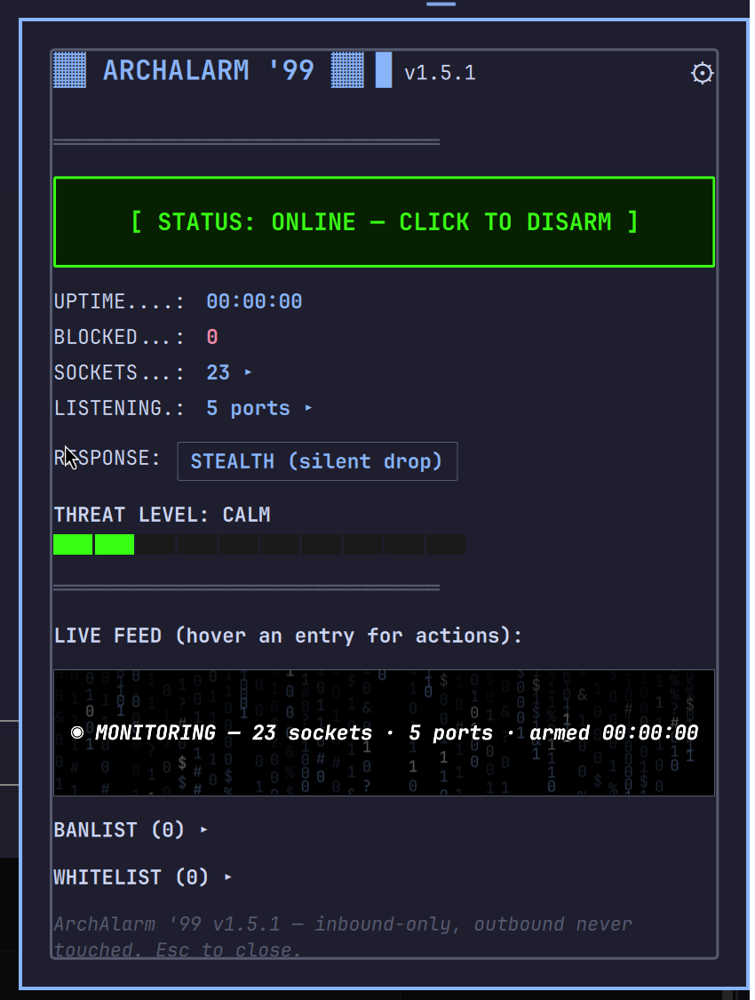

# ArchAlarm '99

```
 █████╗ ██████╗  ██████╗██╗  ██╗ █████╗ ██╗      █████╗ ██████╗ ███╗   ███╗
██╔══██╗██╔══██╗██╔════╝██║  ██║██╔══██╗██║     ██╔══██╗██╔══██╗████╗ ████║
███████║██████╔╝██║     ███████║███████║██║     ███████║██████╔╝██╔████╔██║
██╔══██║██╔══██╗██║     ██╔══██║██╔══██║██║     ██╔══██║██╔══██╗██║╚██╔╝██║
██║  ██║██║  ██║╚██████╗██║  ██║██║  ██║███████╗██║  ██║██║  ██║██║ ╚═╝ ██║
╚═╝  ╚═╝╚═╝  ╚═╝ ╚═════╝╚═╝  ╚═╝╚═╝  ╚═╝╚══════╝╚═╝  ╚═╝╚═╝  ╚═╝╚═╝     ╚═╝
                                                                    '99
```

A real `nftables` firewall for your Linux box, wearing the skin of a
late-90s desktop security suite. Think ZoneAlarm and BlackICE, if they'd
been built for Hyprland instead of Windows 98: a green-on-black panel that
lives in your [Omarchy](https://omarchy.org/) bar, a live feed of blocked
connection attempts scrolling past digital rain, a threat meter that goes
from calm to full dial-up-modem panic, and a one-click BAN hammer for
anything that knocks on a port it wasn't invited to.

It is also, underneath the theatrics, an actual firewall: one isolated
`nftables` table, inbound-only, that never touches your outbound traffic —
browsing, VPNs, dev servers, downloads all keep working exactly as before.
ARM it, and unsolicited inbound connections get logged and dropped. DISARM
it, and it's like it was never there.



## Install

Requires [Omarchy](https://omarchy.org/) (Hyprland + Quickshell) and
`nftables`.

```bash
git clone https://github.com/xer0adon1s/omarchy-archalarm99.git ~/omarchy-archalarm99
cd ~/omarchy-archalarm99
./install.sh
```

The installer symlinks the CLI, daemon, plugin, and systemd unit into the
standard Omarchy locations — it doesn't copy anything, so `git pull` in this
folder is all it ever takes to update. It's also how the in-app updater
works (see below). Follow the two next-steps it prints (add the bar widget,
optionally set up passwordless toggling) and you're armed.

## What it does

- **ARM/DISARM** a single isolated `inet archalarm` nftables table from the
  bar — no other firewall config on the system is touched. **Always starts
  disarmed**: status is cross-checked against whether the monitor daemon is
  actually running, so a stale "enabled" flag left over from a reboot or
  crash never shows as armed.
- **Inbound-only.** There is no output/forward chain. Nothing you initiate —
  browsing, a VPN client, an HTB/THM lab, a sync tool — is ever filtered.
- **Stealth or Reject** response mode, switchable live from the panel.
- **Banlist and whitelist**, both live-editable from the panel or CLI. Trust
  always overrides a ban. Banning is permanent and total: every existing
  feed/offender entry for that IP is purged (not hidden — gone), and any
  further traffic from it produces no entry, no notification, no counter
  increment, ever again.
- **Known-safe filter** (on by default): structurally allow-lists
  multicast/broadcast traffic (mDNS, SSDP, DHCP discovery) instead of
  logging it as an intrusion — this is what stops a device's own network
  chatter from looking like an attack on itself.
- **Reverse DNS** on blocked IPs, resolved in the background.
- **AI trace**: click `[TRACE]` on any entry for a plain-English read on
  what a blocked IP actually is (reverse DNS + WHOIS piped through
  `claude -p`). Each result is kept (last 20) so it can show up in an
  incident report later.
- **Scan pattern labeling**: the daemon tags a new blocked event `PSCAN`
  when the same source hits 3+ different ports within 30s, or `MSCAN`
  when 3+ different sources hit the same port within 30s — shown right in
  the live feed instead of a generic entry, so an actual scan reads
  differently from one stray connection attempt.
- **Incident report export**: click `[EXPORT INCIDENT REPORT]` to dump the
  current session — blocked events (with any scan-pattern tags), top
  offenders, banlist, whitelist, and recent AI traces — to a timestamped
  text file under `~/.local/state/omarchy/archalarm/reports/`.
- Expandable **socket/port/top-offenders** views, a live feed with a digital
  rain idle animation, desktop notifications, and a **theme picker** (plus
  matching the live Omarchy system theme).
- **Passwordless toggle** available via a sudoers rule scoped to exactly one
  script — `omarchy-archalarm setup-sudo` sets it up for you.
- **In-app updater**: checks this repo on GitHub once per boot and at most
  once every 24h, and shows a small `⇪ UPDATE (vX.Y.Z)` badge next to the
  version number when a newer tagged release is out. Click it to fetch,
  check out the new tag, and re-run the installer, with a retro
  dial-up-style progress screen while it works — no manual `git pull`
  needed. A `[RELOAD SHELL NOW]` button appears once it's done — that's
  the only way the panel actually picks up the new version, and it's a
  deliberate click rather than automatic (see the 1.5.16 changelog
  entry for why). The same button lives permanently under Settings too.

## How it stays safe to run

- Everything lives in one isolated nftables table (`inet archalarm`). The
  privileged half of this tool only ever creates or deletes that exact
  table — it never touches `ufw`, `iptables`, or any other table on your
  system.
- There is no output or forward chain, so outbound traffic is never
  evaluated, full stop.
- Established/related connections, loopback, ICMP ping/discovery, DHCP,
  and private LAN ranges (`10/8`, `172.16/12`, `192.168/16`, link-local) are
  always allowed before anything gets logged as a drop.
- The one script that runs as root (`omarchy-archalarm-apply`) does exactly
  one thing — add/remove elements in that one table — and every IP it's
  handed is validated as IP-shaped before it ever reaches an `nft` call.
- Optional passwordless sudo is scoped to that single script's path, not
  general root access — `setup-sudo` shows you exactly what it's granting
  before it grants it.

## CLI reference

```
omarchy-archalarm on               # arm
omarchy-archalarm off              # disarm
omarchy-archalarm toggle           # flip current state
omarchy-archalarm status           # print status.json
omarchy-archalarm mode stealth     # silent drop
omarchy-archalarm mode reject      # visible refusal
omarchy-archalarm knownsafe on     # auto-allow multicast/broadcast noise (default)
omarchy-archalarm knownsafe off    # log every drop, no exceptions
omarchy-archalarm ban <ip>         # permanent block, live if armed; also untrusts <ip>
omarchy-archalarm unban <ip>
omarchy-archalarm trust <ip>       # always-allow, live if armed; also unbans <ip>
omarchy-archalarm untrust <ip>
omarchy-archalarm investigate <ip> # reverse DNS + WHOIS -> claude -p, prints assessment
omarchy-archalarm setup-sudo       # install the passwordless-toggle sudoers rule
omarchy-archalarm report           # export an incident report, prints the file path

omarchy-archalarm-update check         # check GitHub for a newer release (gated to 1/boot, 1/24h)
omarchy-archalarm-update check force   # bypass the gate and check right now
omarchy-archalarm-update install       # fetch + check out the latest tag, re-run install.sh
```

`investigate` requires `whois` and the `claude` CLI on `PATH`; it makes a
live Claude API call and typically takes a few seconds.

---

## Architecture

This repo *is* the install — everything under `~/.local/bin`,
`~/.config/omarchy/plugins/alexander.archalarm`, and the systemd user unit
is a symlink back into a checkout of it. Running `install.sh` by hand
updates that checkout in place, so a manual `git pull` is all it takes.
The in-app updater does it differently: it builds the new version in a
separate `git worktree` (a sibling directory) and only repoints the live
symlinks once that's fully checked out, so the files the running shell
has open never change out from under it mid-update — see the 1.5.6 entry
below for why that matters. The original clone/worktree is left in place
after the first update rather than deleted (worktrees can't remove the
"main" one); later updates clean up their own predecessor normally.

```
omarchy-archalarm99/
├── install.sh          # symlinks everything below into place
├── bin/
│   ├── omarchy-archalarm           # unprivileged CLI
│   ├── omarchy-archalarm-apply     # privileged: nft table/element add/remove
│   ├── omarchy-archalarm-monitor   # unprivileged daemon: tails kernel log + ss
│   └── omarchy-archalarm-update    # unprivileged: checks/pulls new releases
├── plugin/
│   ├── manifest.json    # Omarchy plugin registration
│   ├── Panel.qml         # bar icon + popup panel
│   └── Model.js          # formatting/parsing helpers
└── systemd/
    └── omarchy-archalarm-monitor.service
```

State lives outside the repo, at `~/.local/state/omarchy/archalarm/`:
`status.json` (polled by the panel every 1.5s), `banned.txt`, `trusted.txt`,
`mode`, `knownsafe`, `panel-settings.json`, `update.json`, `last-boot-id`,
`traces.jsonl` (last 20 AI trace results), `reports/` (exported incident
reports).

**Privilege boundary:** `omarchy-archalarm-apply` is the only script that
runs as root (`sudo -n`, falling back to a `pkexec` prompt), and it only
ever touches the `inet archalarm` table. The panel is display-only — it
shells out to `omarchy-archalarm` for every action.

## What gets blocked

Applied by `omarchy-archalarm-apply on <stealth|reject> <banfile> <trustfile> <knownsafe>`:

- Established/related connections and loopback are always allowed.
- Whitelisted IPs are accepted next — trust overrides a stale or
  contradictory ban.
- Banned IPs are dropped before any other rule is checked.
- If the known-safe filter is on: traffic from `0.0.0.0` and anything
  addressed to a broadcast (`255.255.255.255`) or multicast
  (`224.0.0.0/4`, `ff00::/8`) destination is allowed.
- ICMP ping/discovery and DHCP client traffic are allowed.
- Private LAN ranges (`10.0.0.0/8`, `172.16.0.0/12`, `192.168.0.0/16`,
  link-local) are allowed.
- Everything else new and inbound is logged (`ARCHALARM-DROP:` kernel
  prefix) and dropped or rejected depending on mode.
- There is no output/forward chain — outbound traffic is never evaluated.

## Version history

- **1.5.17** — Verification release for 1.5.16: confirms the update
  banner starts the install without touching the bar at all, and that
  the bar only ever restarts on an explicit `[RELOAD SHELL NOW]` click.
- **1.5.16** — Stopped auto-triggering the shell restart after a
  successful install. On a real run, `omarchy restart shell` killed the
  running bar but the relaunch step silently didn't happen, leaving no
  bar at all until someone ran it again by hand — and since the Process
  that ran it had no stdout/stderr capture, there was no way to see why.
  A kill with no relaunch is a strictly worse failure than a panel that
  needs a manual click, so restarting the shell is now only ever a
  deliberate action: a `[RELOAD SHELL NOW]` button on the install result
  screen, plus a permanent copy of the same button under Settings so
  there's always a way to trigger one even if that screen gets
  dismissed first. The likely cause is an environment difference
  between a Quickshell-spawned child process and an interactive shell
  (`omarchy restart shell` reads `HYPRLAND_INSTANCE_SIGNATURE` to talk
  to Hyprland, with a fallback only when that variable is completely
  unset) — not confirmed, since the failure wasn't reproducible on
  demand, which is exactly why this is now a manual action with logged
  output instead of a silent automatic one. If the button itself ever
  fails to bring the bar back, running `omarchy restart shell` in an
  actual terminal is the reliable fallback.
- **1.5.15** — Verification release for the 1.5.13 redundant-click fix:
  a live install from v1.5.14 through the actual button/CLI path,
  including calling `install` several times back-to-back after it
  already succeeded, confirming nothing gets deleted and every
  redundant call safely short-circuits.
- **1.5.14** — Added a version-compare guard on the update banner
  itself: it now only shows when the reported latest version is
  actually newer than this exact component's own compiled-in version,
  never trusting a cached check at face value. Mainly a defense against
  stale state surviving a version jump, but a real safety net either
  way, independent of whatever wrote the cache.
- **1.5.13** — Fixed a genuinely destructive bug: a second `install`
  invocation while already on the latest version — a click on a badge
  that hadn't refreshed after the first click's own restart, or just an
  impatient re-click — recomputed the *exact directory this process was
  currently running from* as its target, then `rm -rf`'d it before
  rebuilding. That's what "second time it failed, something didn't
  exist" actually was. `install` now exits immediately, doing nothing,
  if the current version already matches the latest tag, plus a
  belt-and-suspenders check that refuses to touch a target directory
  that's the live one under any circumstance. Also replaced the silent
  1.8s pause before the shell restart with a visible 3-2-1 countdown —
  a bar vanishing with no warning reads as a crash, not a restart.
- **1.5.12** — Docs only: the header ASCII art was hand-typed block
  characters that didn't actually spell anything reliable across fonts
  — replaced with a proper generated banner. Swapped the README
  screenshot for one taken with the ArchAlarm theme (green-on-black)
  instead of Match System Theme, so the hero image matches the
  project's actual default look instead of one viewer's desktop colors.
- **1.5.11** — Verified 1.5.10 for real: timed a full install from a live
  v1.5.10 through the actual worktree-add/install.sh/systemctl path to
  this release, confirming it completes in seconds with no hang.
- **1.5.10** — Fixed the update flow actually hanging on a real click:
  the "best-effort" cleanup step at the end of `install` (removing the
  now-unused old worktree) had no timeout, so if it ever stalled — a
  stale lock, a filesystem hiccup, anything — the script never reached
  the line that reports success, the QML side never got told the
  process finished, and the panel sat frozen on "UPDATE COMPLETE. GO!!"
  forever with no way out. Every external command `install` runs
  (fetch, worktree add, install.sh, systemctl) is now timeout-bounded,
  and the old-worktree cleanup is gone entirely rather than
  best-effort — old worktrees are just left on disk, which costs
  nothing for a repo this size. Also added two safety nets on the panel
  side that don't depend on diagnosing the exact cause correctly: a
  hard ceiling that ends the animation if nothing has happened after
  110s, and a `[RELOAD SHELL NOW]` button that's always available once
  a result is showing, independent of whether the automatic restart
  fires.
- **1.5.9** — Verified 1.5.8 for real: updated a live install from v1.5.8
  to this release through the actual button/CLI path and confirmed the
  shell restarts itself automatically once "UPDATE COMPLETE" shows, with
  no manual restart needed to see the new version.
- **1.5.8** — Fixed a second real bug uncovered while verifying 1.5.6:
  the 1.5.6 fix stopped the *disruptive* mid-checkout reloads, but a
  single symlink retarget still isn't enough for the panel to actually
  show the new version — Omarchy's plugin loader resolves the symlink
  chain once at discovery and doesn't re-follow it on a hot-reload or
  even `rescanPlugins`, so the panel kept silently showing the old
  version's content until a full shell restart. The panel now triggers
  `omarchy restart shell` itself, timed to its own animation — once the
  "UPDATE COMPLETE" state is reached, not a blind sleep in the backend
  script guessing how long the animation takes.
- **1.5.7** — Verified the 1.5.6 worktree fix for real: updated a live
  install from v1.5.6 to this release through the actual button/CLI path
  and confirmed the panel reload only happens once, at the very end,
  instead of mid-checkout.
- **1.5.6** — Fixed a real bug hit clicking the v1.5.5 updater for the
  first time: checking out the new tag *in place* rewrites Panel.qml and
  Model.js one file at a time — the exact files the running shell has
  symlinked and is watching — so Omarchy's hot-reload fired mid-checkout
  (three times, once per changed file) and tore down the panel, animation
  included, while the update was still copying files. The update itself
  actually finished successfully underneath; it just looked like nothing
  happened. Now `install` builds the new version in a separate git
  worktree first, and only repoints the live symlinks once, atomically,
  after that's done — so a reload only ever happens right at the end,
  after "UPDATE COMPLETE" has already shown.
- **1.5.5** — Two "Future ideas" shipped: incident report export
  (`[EXPORT INCIDENT REPORT]` in the panel, `omarchy-archalarm report` on
  the CLI) and scan pattern labeling (`PSCAN`/`MSCAN` tags on feed
  entries, computed by the daemon from a 30s window of recent events).
  The pattern tag sits right after the timestamp rather than at the end
  of the line, so it survives `ElideRight` truncation on a long row
  instead of getting cut off along with everything else.
- **1.5.4** — Verified end-to-end: rolled a live install back to v1.5.3 and
  used the real in-app updater to bring it forward to this release, to
  confirm fetch → checkout → reinstall → reload actually works and not
  just the version-comparison logic in isolation.
- **1.5.3** — Two real bugs found by actually running the 1.5.2 updater
  end-to-end: `omarchy-archalarm-update` derived its own location from
  `$BASH_SOURCE`, but it's always invoked through the `~/.local/bin`
  symlink, so it was resolving to the wrong directory entirely and every
  check silently failed with "couldn't reach GitHub." Also, the `⇪ UPDATE`
  badge lived inline in the header next to the gear icon with no width
  cap, so a longer version string would run into it — moved to its own
  full-width banner underneath instead.
- **1.5.2** — Moved to a real GitHub repo (`bin/`, `plugin/`, `systemd/`) —
  everything under `~/.local/bin`, the Omarchy plugin directory, and the
  systemd user unit is now a symlink into this checkout, installed via
  `install.sh`. Added an in-app updater: checks GitHub for a newer tagged
  release once per boot and at most once every 24h, shows an `⇪ UPDATE`
  badge next to the version number when one's out, and installs it with a
  retro dial-up-style progress animation on click. Added
  `omarchy-archalarm setup-sudo`, which generates and installs the
  passwordless-toggle sudoers rule for whoever's actually running it
  (the old setup command had this machine's home directory hardcoded).
- **1.5.1** — Full diagnostic pass, two real bugs fixed: the "always starts
  disarmed" self-heal check compared against `"enabled":true` with no space,
  but status.json is always written with a space after the colon, so it
  never actually matched — a stale "enabled" flag would have stuck around
  instead of resetting. Also added IP-format validation to
  `ban`/`unban`/`trust`/`untrust` (previously any string was accepted and
  written straight to the ban/whitelist files and into the privileged nft
  call). Fixed a text-overflow bug where the "INTRUSION ATTEMPT DETECTED"
  banner could run past the panel's edge instead of wrapping.
- **1.5** — Known-safe filter: auto-allow multicast/broadcast destination
  traffic (mDNS, SSDP, DHCP) so it stops producing false-positive alerts,
  toggleable in Settings. Top offenders made collapsible. Banning now purges
  every existing feed/offender entry for that IP, not just future ones, and
  the daemon independently refuses to re-record a hit from a banned IP as a
  second guard beyond the nft rule order. Ban/trust actions animate instead
  of vanishing silently. Bar icon and status text use fixed traffic-light
  colors (green/yellow/red) independent of the active theme.
- **1.4** — Whitelist added alongside the banlist. Always starts disarmed
  (status self-heals against a stale "enabled" flag). Live feed box shrunk
  and shows a live status line instead of static text. Settings menu (⚙)
  with a theme picker: ArchAlarm, Amber CRT, Cyber Red Alert, or match the
  live Omarchy system theme.
- **1.3** — Expandable socket list. AI-backed IP trace (`investigate`).
  Banlist collapsed by default.
- **1.2** — Idle animation in the live feed panel.
- **1.1** — Renamed RetroWall '95 → ArchAlarm '99. Added ban list, reverse
  DNS, stealth/reject mode, passwordless sudoers option.
- **1.0** — Initial release: ARM/DISARM, live blocked-connection feed, threat
  meter, inbound-only nftables backend.

## Future ideas (not implemented)

- **Session summary on disarm** — a toast on DISARM: block count, unique IPs,
  top offender.
- **Auto-arm at login** — opt-in setting; stays off by default.

## License

MIT — see [LICENSE](LICENSE).
